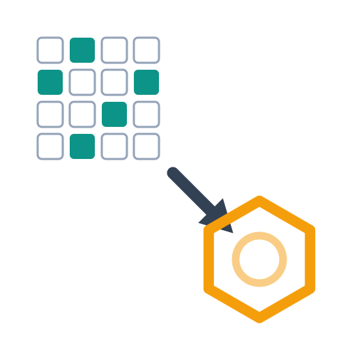
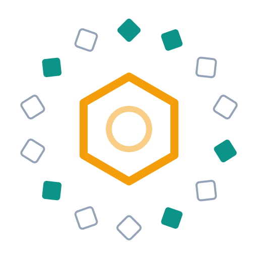

# Logo concepts

Eight marks, one palette, so they can be compared on idea and shape rather
than colour. Every file is a hand-written SVG with a `prefers-color-scheme`
block, so it reads on both GitHub themes and uses no pure black or white.

Concept 01 appears three times. The idea was liked but the original is a
left-to-right strip, which wastes a square and dies at favicon size, so 01b
and 01c are the same three elements rearranged to fit one.

| | concept | the idea | at 32px |
|---|---|---|---|
|  | **01 bits-to-ring** | A sparse bit grid, an arrow, a molecule. The most literal statement of what the project does. | poor — left to right, the grid dissolves |
|  | **01b bits-diagonal** | The same three elements hung on the square's diagonal, its longest axis, instead of its width. | fair — the grid becomes texture but still reads |
|  | **01c bits-ring** | No left and no right: the folded bit vector *is* the ring, and the structure sits inside it. | **good** — radially symmetric, nothing wasted |
|  | **02 morgan-radii** | What "Morgan radius 2" actually means: nested atom environments around a centre atom. The only mark that depicts the *algorithm*. | fair |
|  | **03 fingerprint-whorl** | A fingerprint in the other sense. The ridges stop where the whorl would close and a molecule takes over. | **good** |
|  | **04 reversal** | Hashing runs one way; this arrow runs the other, back from the bits to the structure. | **best** |
|  | **05 constellation** | Scattered set bits on the left condensing into a connected graph on the right. | poor — noisy |
|  | **06 oracle-match** | Two identical bit columns and a tick. The project's real foundation is that the answer is checkable. | poor — too busy |

## Recommendation

**04 reversal** as the icon. It is the only one that stays legible at favicon
size, it fills a square without an awkward horizontal bias, and the idea it
carries — a one-way function run backwards — is the whole project in one
gesture rather than an illustration of the inputs and outputs.

Its arrowhead was rebuilt on 2026-10-11. The first version was a triangle
placed by eye: it sat 53 degrees off the arc's tangent and overlapped the
stroke, so it read as a pennant rather than a head and vanished entirely at
32px. The geometry is now computed rather than guessed, and the numbers and
their reasons are written into the SVG's own comment: the head is tangent at
35 degrees, and the stroke stops 8 units short of its base so the round cap
is swallowed instead of bulging past it.

**01c bits-ring** is the runner-up, and the better of the two if the mark is
ever wanted without an arrow in it. **03 fingerprint-whorl** remains the most
charming, and the pun lands without being laboured.

**05** and **06** are left-to-right compositions and weak icons, though they
would work as a wide banner. **02** is the most technically honest and the
least immediately legible.

For a wide image there is no longer any need to press one of these into
service: `docs/images/banner.jpg` is concept 01's idea — bits on the left
coming apart into structures on the right — realised at 3:1.

## Rendering

```bash
rsvg-convert -w 512 -h 512 -b white docs/logos/04-reversal.svg -o logo.png
```
