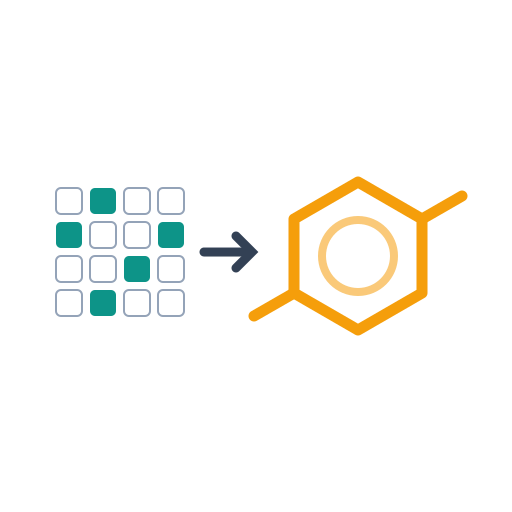
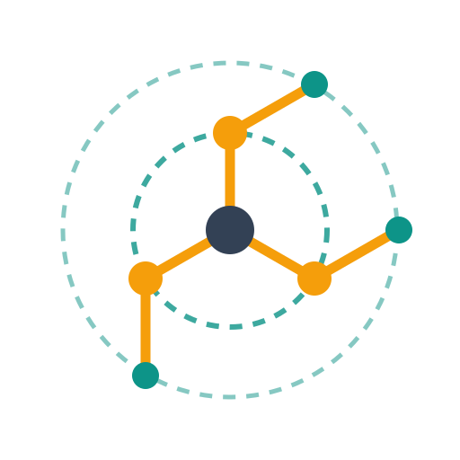
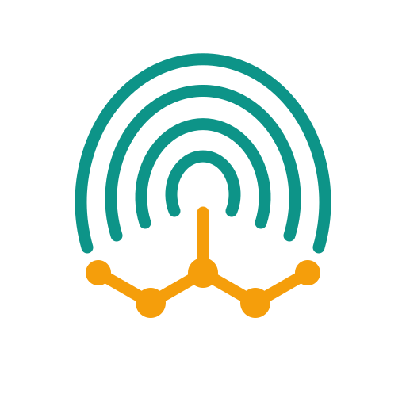
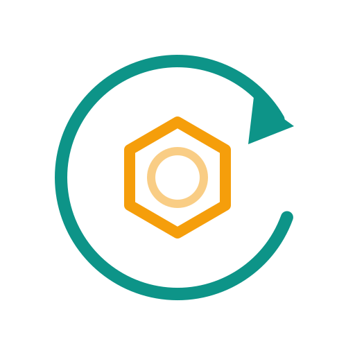
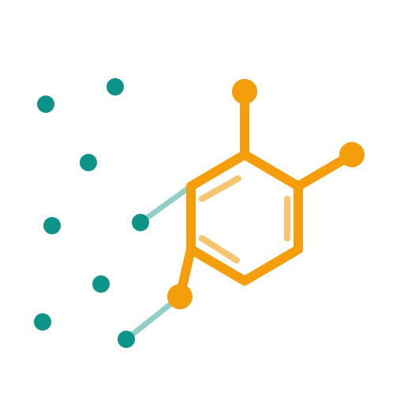
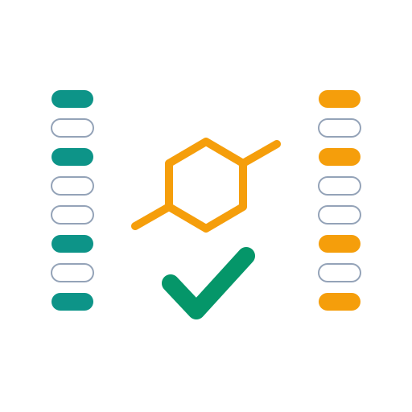

# Logo concepts

Six marks, one palette, so they can be compared on idea and shape rather than
colour. Every file is a hand-written SVG with a `prefers-color-scheme` block,
so it reads on both GitHub themes and uses no pure black or white.

| | concept | the idea | at 32px |
|---|---|---|---|
|  | **01 bits-to-ring** | A sparse bit grid, an arrow, a molecule. The most literal statement of what the project does. | poor — the grid dissolves |
|  | **02 morgan-radii** | What "Morgan radius 2" actually means: nested atom environments around a centre atom. The only mark that depicts the *algorithm*. | fair |
|  | **03 fingerprint-whorl** | A fingerprint in the other sense. The ridges stop where the whorl would close and a molecule takes over. | **good** |
|  | **04 reversal** | Hashing runs one way; this arrow runs the other, back from the bits to the structure. | **best** |
|  | **05 constellation** | Scattered set bits on the left condensing into a connected graph on the right. | poor — noisy |
|  | **06 oracle-match** | Two identical bit columns and a tick. The project's real foundation is that the answer is checkable. | poor — too busy |

## Recommendation

**04 reversal** as the icon. It is the only one that stays legible at favicon
size, it fills a square without an awkward horizontal bias, and the idea it
carries — a one-way function run backwards — is the whole project in one
gesture rather than an illustration of the inputs and outputs.

**03 fingerprint-whorl** is the runner-up and the more charming of the two; it
survives small sizes and the pun lands without being laboured.

**01**, **05** and **06** are left-to-right compositions. They are weak icons
but would work as a wide README banner, where there is room for the sequence to
read. **02** is the most technically honest and the least immediately legible.

## Rendering

```bash
rsvg-convert -w 512 -h 512 -b white docs/logos/04-reversal.svg -o logo.png
```
